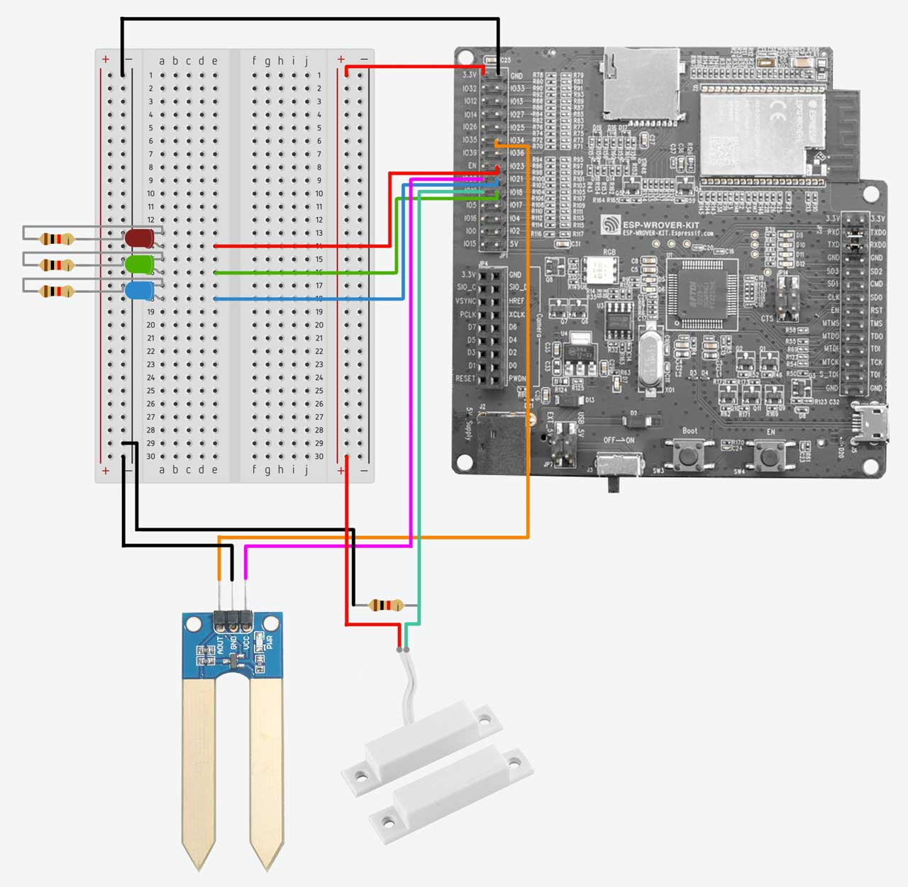

# ESP32 & Embedded Edge Agent
This template demonstrates how to use the WEGnology [Embedded Edge Agent (EEA)](https://docs.app.wnology.io/edge-compute/embedded-edge-agent/overview/) to remotely monitor and control an ESP32's GPIO using WEGnology's drag-and-drop [Embedded Workflows](https://docs.app.wnology.io/workflows/embedded-workflows/). This template is designed to provide implementation and architectural guidance for organizations that wish to utilize the ESP32 as the primary module for their connected products.

## Key Components
* Example [ESP32 firmware](https://github.com/WEGnology/eea-examples/tree/main/esp32) that implements the [Embedded Edge Agent](https://docs.app.wnology.io/edge-compute/embedded-edge-agent/overview/).
* Set of [Registered Functions](https://docs.app.wnology.io/edge-compute/embedded-edge-agent/agent-api/#registered-function-api) that wrap the ESP32's underlying [GPIO](https://docs.espressif.com/projects/esp-idf/en/latest/esp32/api-reference/peripherals/gpio.html) and [ADC](https://docs.espressif.com/projects/esp-idf/en/latest/esp32/api-reference/peripherals/adc.html) functionality.
* Embedded Workflow to blink and control the [ESP32-WROVER-KIT's](https://docs.espressif.com/projects/esp-idf/en/latest/esp32/hw-reference/esp32/get-started-wrover-kit.html) onboard [RGB LED](https://docs.espressif.com/projects/esp-idf/en/latest/esp32/hw-reference/esp32/get-started-wrover-kit.html#rgb-led).
* Embedded Workflow to read a variety of digital and analog inputs and report their values to the WEGnology platform.
* Dashboard to remotely monitor and control your ESP32.

## Required Hardware
This template recommends the [ESP32-WROVER-KIT](https://docs.espressif.com/projects/esp-idf/en/latest/esp32/hw-reference/esp32/get-started-wrover-kit.html), which can be purchased from [Adafruit](https://www.adafruit.com/product/3384). The EEA requires 1-2MB of memory, so any ESP32 module with additional PSRAM is supported.

This template comes with two [Embedded Workflows](https://docs.app.wnology.io/workflows/embedded-workflows/). The **Blink LED** workflow is designed to use the onboard RGB LED that comes with the ESP32-WROVER-KIT. This does not require any additional hardware.

The **GPIO** workflow demonstrates reading and controlling a variety of inputs and outputs. This workflow can be modified to match your specific ESP32 I/O configuration. By default, it assumes the following inputs and outputs are connected to the ESP32.

* **Digital Outputs**
  * Onboard RGB LEDs: Red (0), Green (2), Blue (4)
  * External LEDs: Red (23), Green (18), Blue (21)
  * Voltage output for the moisture sensor (34)
* **Digital Input**
  * Magnetic contact switch (19)
* **Analog Input**
  * Moisture sensor (ADC1, Channel 6)

## ESP32 Firmware
The firmware required to implement the EEA for this template can be found in the following repository:

https://github.com/WEGnology/eea-examples/tree/main/esp32

Please follow the steps in that repository's README to configure and flash the firmware to your ESP32.

### Device ID, Access Key, Access Secret

The firmware requires a device ID, access key, and access secret. This template comes with a pre-configured **ESP32** device. To obtain these credentials, create an [Access Key](https://docs.app.wnology.io/applications/access-keys/) for this device and use this device's ID.

## Embedded Workflows
Once the above firmware has been flashed to your ESP32 and the device has connected to the WEGnology platform, you can deploy this template's [Embedded Workflows](https://docs.app.wnology.io/workflows/embedded-workflows/) to your device.

### Blink LED Workflow
The **Blink LED** workflow toggles the ESP32-WROVER-KIT's [onboard RGB LED](https://docs.espressif.com/projects/esp-idf/en/latest/esp32/hw-reference/esp32/get-started-wrover-kit.html#rgb-led). The RGB LED is controlled using three digital outputs: red (0), green (2), and blue (4).

By default, the workflow will blink the LED automatically on a 1-second interval. This behavior can be changed by sending the device a "blink" [command](https://docs.app.wnology.io/devices/commands/) with a payload of either `true` or `false` to enable or disable automatic blinking.

The workflow also supports a "toggle" command (with no payload) to manually toggle the LED on or off.

The "blink" and "toggle" commands can be sent to your device using the [Input Controls Block](https://docs.app.wnology.io/dashboards/input-controls/) found within this template's **ESP32 GPIO** dashboard.

### GPIO Workflow

*Note: the GPIO workflow contains everything found in the Blink LED workflow, so removing the Blink LED workflow from your device before deploying the GPIO workflow is required.*

The **GPIO** workflow expands on the previous workflow and adds support for the digital and analog inputs pictured in the above wiring diagram. This workflow also introduces [Device State](https://docs.app.wnology.io/devices/state/) and reports data under two scenarios:

1. Periodic snapshots of all I/O on a 60-second interval.
1. Immediately whenever the state of the external LEDs or magnetic contact switch changes.

The combination of capturing periodic snapshots as well as immediately when something changes is a common implementation practice. The snapshots provide historical information for values that don’t change often and the immediate reports allow for real-time alerting and notifications using [Application Workflows](https://docs.app.wnology.io/workflows/application-workflows/). This template uses a 60-second snapshot interval for demonstration purposes, but in most production use cases, the interval would be much longer (e.g. 1 hour).

Any data reported as device state is automatically saved on a [device's attributes](https://docs.app.wnology.io/devices/attributes/). This template's **ESP32** device has preconfigured attributes for the moisture sensor, contact switch, and the state of each external LED.

To change the state of the external LEDs, this workflow implements the "set_output" command. This command includes a payload that is an array of digital output pins and their desired value. This command can be sent to your device using the Input Controls block on the **ESP32 GPIO** dashboard.

## ESP32 GPIO Dashboard
This template's **ESP32 GPIO** dashboard contains everything required to remotely visualize and control your ESP32's GPIO.

The dashboard's [Input Controls Block](https://docs.app.wnology.io/dashboards/input-controls/) can send the "blink", "toggle", and "set_output" commands to control the onboard and external LEDs.

The dashboard also contains various [Gauge Blocks](https://docs.app.wnology.io/dashboards/gauge/) and [Time Series Graphs](https://docs.app.wnology.io/dashboards/time-series-graph/) to visualize the ESP32's current and historical digital and analog values.

## License

Copyright &copy; 2022 WEGnology. All rights reserved.

Licensed under the [MIT](https://github.com/WEGnology/wegnology-templates/blob/master/LICENSE.txt) license.

