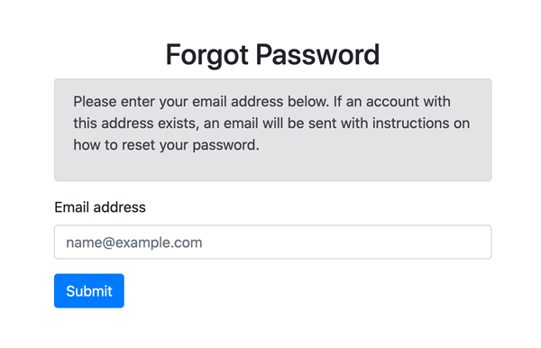
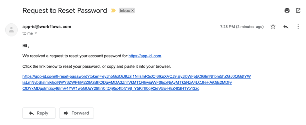
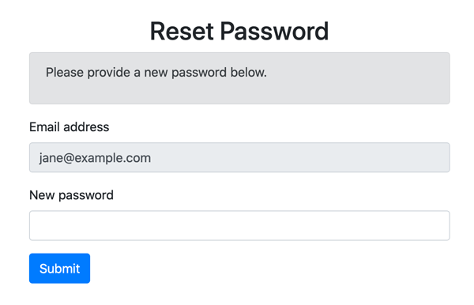

# Forgot Password
This template provides all the necessary Endpoints, Workflows, and Pages to deliver "forgot password" and "password reset" functionality.

When a user submits their email address to the Forgot Password page, a digitally signed JWT reset token is generated and a reset link is emailed to that address. When that link is clicked, the token is verified and the user is allowed to submit a new password through the Reset Password page.

## Setup
1. Create a `tl-jwt-reset-secret` [Application Global](https://docs.app.wnology.io/applications/overview/#application-globals) and set it to any string value. It should be a sufficiently complex string, much like a password. This is used to sign your JWT tokens. Never share this value.
2. Create a `tl-jwt-reset-issuer` [Application Global](https://docs.app.wnology.io/applications/overview/#application-globals) and set it to a string value that is your company's domain (e.g. example.com).

## Endpoint Routes
This template includes endpoints that may conflict with endpoints that already exist in your application. To successfully import this template, you must remove or rename any existing endpoints that have the following routes:

* `GET /forgot-password`
* `POST /forgot-password`
* `GET /reset-password`
* `POST /reset-password`

## How to Use this Template
To use this template, the only thing you need to add is a link somewhere in your experience to the Forgot Password Page (`/forgot-password`). The most common place to add a Forgot Password link is on your Log In page near the Submit button.

```
<a href="/forgot-password">Forgot your password?</a>
```

## Forgot Password Process, Step-by-Step
This section describes the process your users will experience when resetting their passwords using this template.

### User Submits a Forgot Password Request
Once a user clicks the Forgot Password link on your Log In page, they're presented with a form to enter their email. This form always displays a success message regardless of whether or not the user exists in your application. This is to prevent attackers from spamming this form looking for valid email addresses.

This page can be customized by editing the `tl-page-forgot-password` experience page.



### 2. User Receives a Reset Password Email
If the user exists, they will receive an email with a reset link that contains a signed JWT token. If the user does not exist, an email is still sent to that address, however it indicates a password reset was requested, but no account was found. This is useful for users that may have multiple email addresses and cannot recall which one was used to sign up for your service.

The specific content of the email can be changed by editing the `Reset Password` workflow.



### 3. User Resets Password
When the link in the email is clicked, the token is sent to the Reset Password page. If the token is valid, the user can enter a new password for their account. If there are any issues with the token, the user is redirected to the Forgot Password page to attempt another reset request. If the reset process is successful, the user is re-logged in and redirected to the home page ('/').

This page can be customized by editing the `tl-page-reset-password` experience page.



## Page Layouts
The pages that are included in this template contain markup that would typically be found in an [Experience Layout](https://docs.app.wnology.io/experiences/views/#layouts). This was done so that these pages could be used immediately without additional configuration. For production applications, you may want to modify these pages to use them within an existing layout. `PAGE_START` and `PAGE_END` comments have been added to each page's code to indicate which section to keep when using a custom layout.

## License

Copyright (c) 2023 WEGnology. All rights reserved.

Licensed under the [MIT](https://github.com/WEGnology/wegnology-templates/blob/master/LICENSE.txt) license.