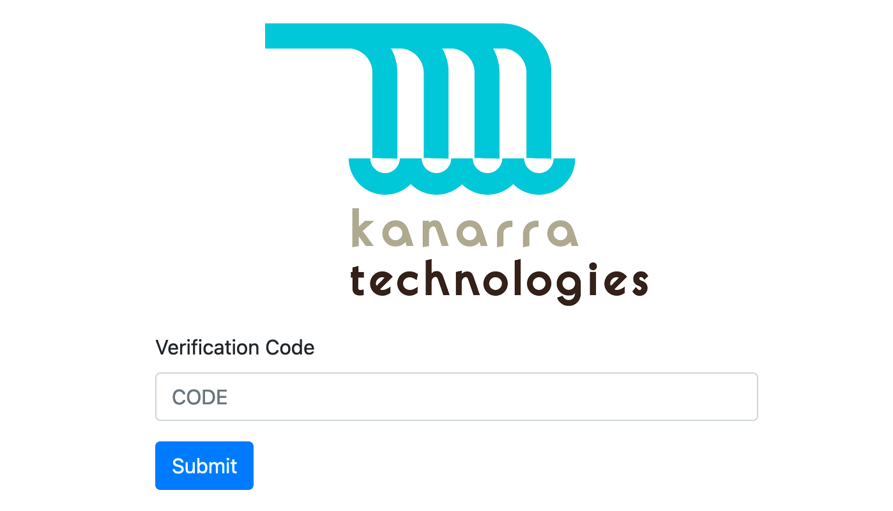

# SMS Two-Factor Authentication with Twilio Verify

This template is an example implementation of SMS-based two-factor authentication using [Twilio Verify](https://www.twilio.com/verify) within WEGnology Experiences. Leveraging Twilio Verify, this template could be extended to support [phone, email, and push notifications](https://www.twilio.com/verify).

## Usage 

After importing this template:

1. Create or update an experience user with a tag `phone` in the format of `+15017122661` (see [Twilio](https://www.twilio.com/docs/glossary/what-e164) for formatting).
2. Include required template globals (see below).
3. Navigate to `GET /tl-verify-login`.
4. Login and enjoy 2FA.

## How the Template Works

When complete, you will have imported the following logic:

1. The experience user navigates to `GET /tl-verify-login` and logs in with experience credentials.
2. Upon successful login, the `POST /tl-verify-login` uses the [Twilio Verification API](https://www.twilio.com/docs/verify/api/verification) to send a verification code to the experience user's phone.
3. The user is redirected to `GET /tl-verify-form?token=JWT_TOKEN`. In the verification form, the user must enter the code received from Twilio.  
4. The user-entered code is sent to the [Twilio Verification Check API](https://www.twilio.com/docs/verify/api/verification-check). 
5. If the verification was successful, the user is authenticated to the experience and redirected to `/`.

## Template Globals

This template requires the following globals:

### Twilio Account SID

Global: `TWILIO_ACCOUNT_SID`

You may find your Twilio Account SID in the [Twilio Console](https://www.twilio.com/console).

### Twilio Authentication Token

Global: `TWILIO_AUTH_TOKEN`

You may find your Twilio Authentication Token in the [Twilio Console](https://www.twilio.com/console).

### Verification Service SID

Global: `VERIFICATION_SID`

You may find your Verification Service SID in the [Twilio Verify Services Console](https://www.twilio.com/console/verify/services).

### Secret

Global: `TL_VERIFY_SECRET`

This template uses a [JWT token](https://jwt.io/introduction/) as part of the 2FA process. This secret is used to sign and verify the token. This should be a sufficiently complex string, similar to a strong password.

## Resources

- [Twilio Verify](https://www.twilio.com/docs/verify/api)
- [What is two-factor authentication](https://authy.com/what-is-2fa/)

---

## License

Copyright (c) 2023 WEGnology. All rights reserved.

Licensed under the [MIT](https://github.com/WEGnology/wegnology-templates/blob/master/LICENSE.txt) license.