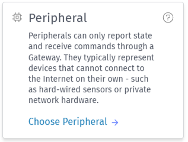
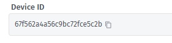
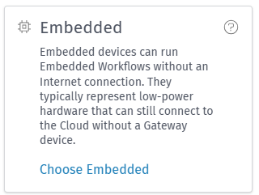
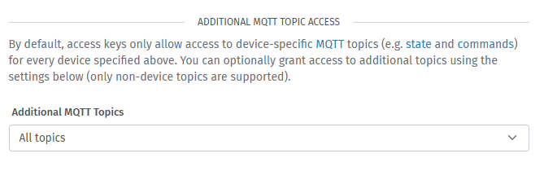
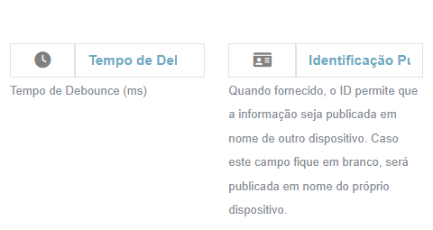

# Peripherals : Publishing on Behalf of Other Devices

In this template, we will demonstrate how to publish on behalf of other devices, using a device of the "Embedded" type and another of the "Peripheral" type.

## Workflow
The application workflow will capture messages published to the "edge/+/eea/peripherals" topic by the Embedded device. The workflow will filter the messages and identify the ID present in the topic payload, publishing it to the device that contains the message ID. In this way, it is possible to discretize the obtained data.

## Configuration

For this template, it is necessary to configure the device whose name will be published (Peripheral) and the device that will perform the publishing (Embedded).

### Peripheral

To configure the peripheral, you need to create a device of the "Peripheral" type.

Save the ID of the generated device to use in the configuration of the other devices.

### Embedded

To configure the edge, you need to create a device of the "Embedded" type to serve as a "gateway" for the peripheral.

Create an access key with all available MQTT topics to enable posting to topics other than those exclusive to the device.

Add the generated key to the device on the connection screen with the WEGnology IoT Platform and establish a MODBUS or IOs connection.
In this connection, the generated peripheral ID will be entered. The area to enter the peripheral ID in MODBUS appears as follows:

The area to enter the peripheral ID in IOs appears as follows:

In this way, the peripheral information is already being published in the application workflow.

Note: This is valid for devices with the native workflow. If there is any workflow, it will be overwritten and manual publishing will be required.

## Setup

  1. Import this template into the WEGnology platform in the Application Workflows section.
  2. Initialize the workflow.

---

Copyright (c) 2025 WEGnology
